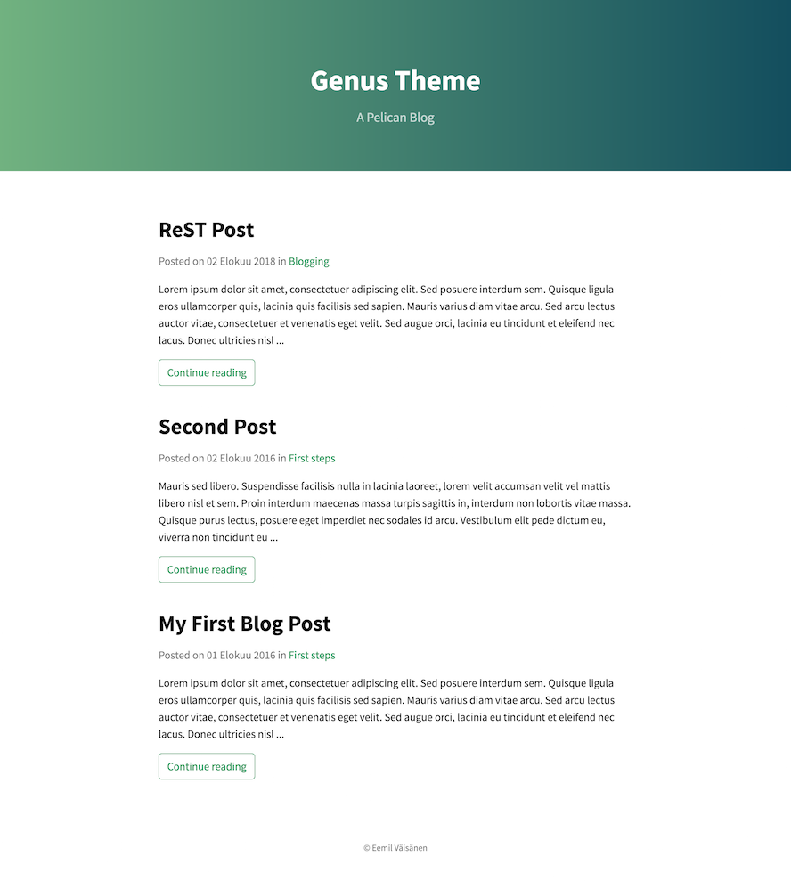

# Genus

Genus is a theme for [Pelican](http://blog.getpelican.com/) static site generator designed mobile first and SEO in mind.

This theme draws inspiration from [Cayman](https://github.com/jasonlong/cayman-theme) GitHub Pages theme, [Type](https://github.com/rohanchandra/type-theme) theme for Jekyll, [Medius](https://github.com/onur/medius) for Pelican and [Medium](https://medium.com/).

## Screenshot

[Screenshot of a blog post](doc/img/single_post.png)

## License

The MIT License ([LICENSE](LICENSE.txt))
